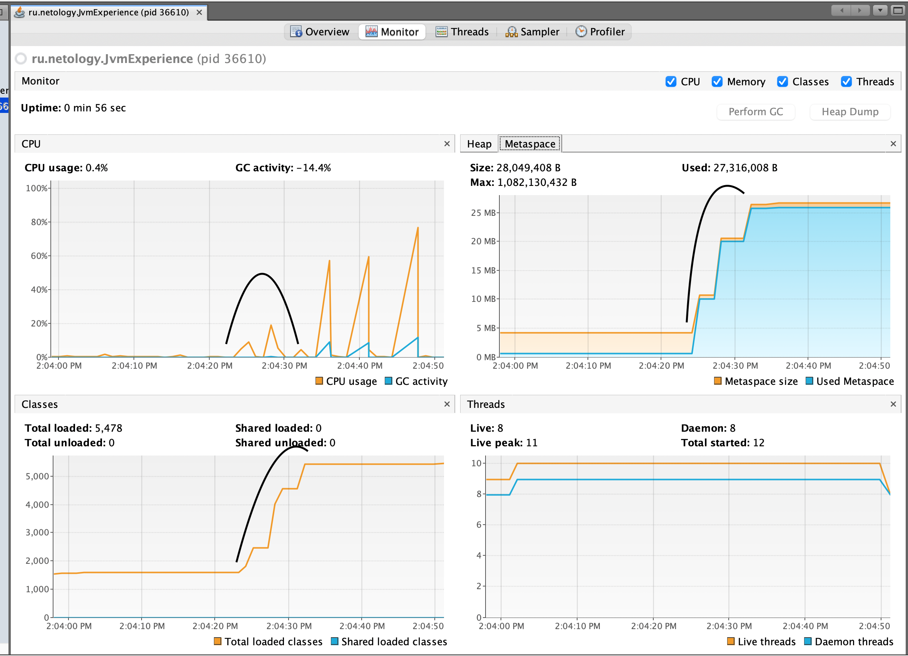
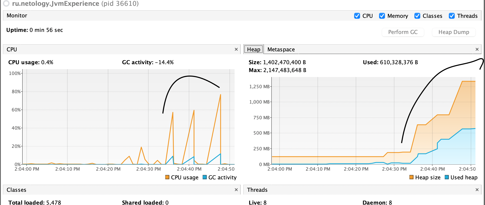

# Project: VisualVM

## Анализ работы

***

После запуска программы на графике выделил пики, когда в методе *main*:

* вызывался метод *loadToMetaspaceAllFrom*, который загружал информацию о классах с паузой из 3 пакетов
* тем самым расширяя область памяти **Metaspace**, но не существенно влияя на **Heap**.
* видны всплески CPU во время загрузки, но они отсутствуют для GC, т.к. почти не создаётся новых объектов.

  

Следующим этапом генерируется также с паузами множество простых объектов посредством вызова пары методов, при этом:

* существенно растёт утилизация CPU, а также его использование GC, т.к. требуется посчитать графы для огромного числа объектов.
* Heap значительно растёт, при этом GC не чистит его, т.к. формально объекты пока нужны

  